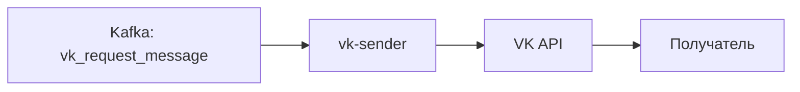

## О приложении

vk-sender потребляет `SendMessageRequest` из Kafka и вызывает метод `messages.send` VK API. Он собирает HTTP‑запрос, добавляет `random_id`, обрабатывает JSON‑ответ и логирует ошибки, чтобы supervisor мог перезапустить подписку.

## Роль приложения в архитектуре проекта

Это завершающий элемент VK‑конвейера:
```
... → vk-response-preparer → vk-sender
```
Все предыдущие сервисы уже решили, что и куда отправить; sender взаимодействует только с внешним API и гарантирует доставку пользователю.

## Локальный запуск

1. Требования: Go ≥ 1.24, Kafka и токен сообщества VK с правами отправки сообщений.
2. Экспортируйте переменные:
   - `KAFKA_BOOTSTRAP_SERVERS_VALUE`, `KAFKA_TOPIC_NAME_VK_REQUEST_MESSAGE`, `KAFKA_GROUP_ID_VK_SENDER`, `KAFKA_CLIENT_ID_VK_SENDER`, опционально `KAFKA_SASL_USERNAME`/`KAFKA_SASL_PASSWORD`.
   - `VK_TOKEN` — access token для `messages.send`.
3. Запустите:
   ```bash
   go run ./cmd/vk-sender
   ```
   или через Docker.
4. Следите за логами: при успехе появится запись `✅ Message sent`, при ошибках VK API приложение вернёт ошибку и supervisor перезапустит consumer. Убедитесь, что `vk-response-preparer` пишет заявки в `KAFKA_TOPIC_NAME_VK_REQUEST_MESSAGE`.
